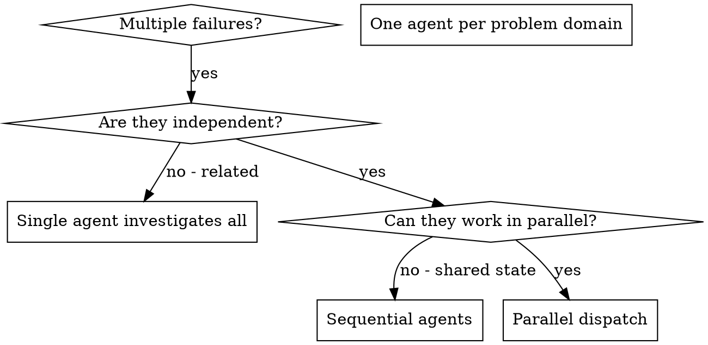

# Dispatching Parallel Agents

## Overview

Delegate tasks to specialized agents with isolated context. Construct exactly what each agent needs — they should never inherit your session's context or history. This preserves your own context for coordination work.

When you have multiple unrelated failures (different test files, different subsystems, different bugs), investigating them sequentially wastes time. Each investigation is independent and can happen in parallel.

**Core principle:** Dispatch one agent per independent problem domain. Let them work concurrently.

## When to Use



**Use when:**
- 3+ test files failing with different root causes
- Multiple subsystems broken independently
- Each problem can be understood without context from others
- No shared state between investigations

**Don't use when:**
- Failures are related (fixing one might fix others)
- Need to understand full system state
- Agents would interfere with each other (editing same files, same resources)

## The Pattern

### 1. Identify Independent Domains

Group failures by what's broken:
- File A tests: Tool approval flow
- File B tests: Batch completion behaviour
- File C tests: Abort functionality

Each domain is independent — fixing tool approval doesn't affect abort tests.

### 2. Create Focused Agent Tasks

Each agent gets:
- **Specific scope:** One test file or subsystem
- **Clear goal:** Make these tests pass
- **Constraints:** Don't change other code
- **Expected output:** Summary of what you found and fixed

### 3. Dispatch in Parallel

Issue all subagent dispatches in the same response — they run in parallel:

```text
Subagent: "Fix agent-tool-abort.test.ts failures"
Subagent: "Fix batch-completion-behavior.test.ts failures"
Subagent: "Fix tool-approval-race-conditions.test.ts failures"
# All three run concurrently.
```

Multiple dispatch calls in one response = parallel execution. One per response = sequential.

### 4. Review and Integrate

When agents return:
- Read each summary
- Verify fixes don't conflict
- Run full test suite
- Integrate all changes

## Agent Prompt Structure

Good agent prompts are focused, self-contained, and specific about output:

```markdown
Fix the 3 failing tests in src/agents/agent-tool-abort.test.ts:

1. "should abort tool with partial output capture" - expects 'interrupted at' in message
2. "should handle mixed completed and aborted tools" - fast tool aborted instead of completed
3. "should properly track pendingToolCount" - expects 3 results but gets 0

These are timing/race condition issues. Your task:

1. Read the test file and understand what each test verifies
2. Identify root cause - timing issues or actual bugs?
3. Fix by:
   - Replacing arbitrary timeouts with event-based waiting
   - Fixing bugs in abort implementation if found
   - Adjusting test expectations if testing changed behavior

Do NOT just increase timeouts - find the real issue.

Return: Summary of what you found and what you fixed.
```

## Common Mistakes

**Too broad:** "Fix all the tests" — agent gets lost. Prefer: "Fix agent-tool-abort.test.ts"

**No context:** "Fix the race condition" — agent doesn't know where. Paste error messages and test names.

**No constraints:** Agent might refactor everything. Specify: "Do NOT change production code."

**Vague output:** "Fix it" — you don't know what changed. Specify: "Return summary of root cause and changes."

## Verification

After agents return:
1. Review each summary — understand what changed
2. Check for conflicts — did agents edit the same code?
3. Run full suite — verify all fixes work together
4. Spot check — agents can make systematic errors
