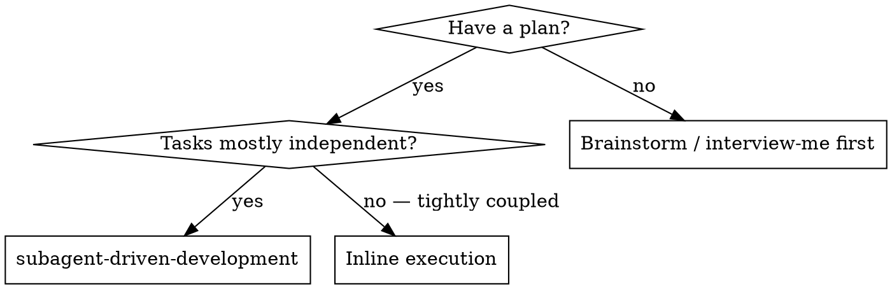
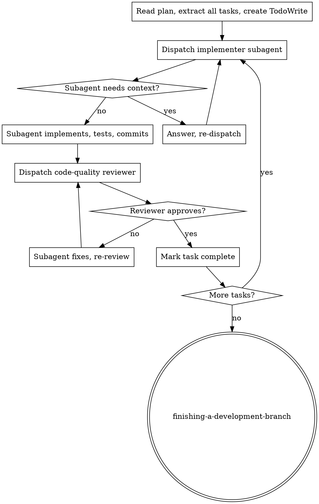

# Subagent-Driven Development

Execute a plan by dispatching a fresh subagent per task, with a code-quality review after each. The subagent gets full task text and context — never the session history.

**Core principle:** Fresh context per task + review checkpoint = high quality, no context drift.

**Continuous execution:** Do not pause between tasks to check in. Execute all tasks from the plan without stopping. Stop only when: blocked and cannot resolve, ambiguity prevents progress, or all tasks are complete.

## When to Use

## The Process

## Model Selection

Match model to task complexity — Opus is expensive, use it only when judgment is required:

| Task type | Model |
|-----------|-------|
| Isolated function, clear spec, 1–2 files | Haiku |
| Multi-file coordination, integration concerns | Sonnet |
| Architecture, design, debugging, review | Opus |

## Implementer Subagent Prompt

Provide the subagent:
1. **Full task text** from the plan — don't make it read the file
2. **Scene-setting context**: where this task fits in the overall plan
3. **Pattern to mirror**: exact file path of closest existing example
4. **Constraints**: don't touch files outside the task scope
5. **Expected output**: "commit the change, report status + what changed"

## Handling Implementer Status

- **DONE** — proceed to code-quality review
- **DONE_WITH_CONCERNS** — read concerns; if correctness/scope, address before review; if observations, note and proceed
- **NEEDS_CONTEXT** — provide missing context, re-dispatch
- **BLOCKED** — assess: context problem → more context + re-dispatch; task too large → break it down; plan is wrong → escalate to user

## Code-Quality Reviewer Prompt

Give the reviewer:
- The task spec (what should have been built)
- The git diff (`git diff HEAD~1..HEAD` or specific SHAs)
- Checklist: correctness, scope (nothing extra built), test coverage, consistency with existing patterns, no lint errors

Severity tiers: **Critical** (fix now), **Important** (fix before next task), **Minor** (note for later).

## Red Flags

**Never:**
- Start implementation on `main` without explicit user consent — work on a branch
- Skip the code-quality review
- Dispatch multiple implementer subagents in parallel (write conflicts)
- Pass the plan file path to the subagent — provide the full task text
- Accept "close enough" when the reviewer flagged issues
- Move to the next task while the reviewer has open findings

**If the subagent reports BLOCKED twice on the same task:** escalate to the user rather than re-dispatching again.

## Integration

- **Before this skill:** `brainstorming` → `interview-me` → `writing-plans`
- **After this skill:** `finishing-a-development-branch`
- **Subagents should use:** `test-driven-development` for each task
