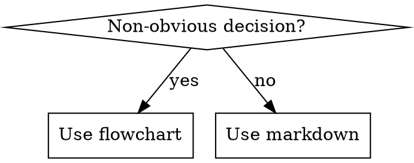

# Writing Skills

Skills are reference guides for proven techniques, patterns, or tools. Writing them follows the same discipline as writing code: test first, minimal content, no placeholders.

**Core principle:** If you didn't verify an agent follows the skill, you don't know if it works.

## What Is a Skill?

**Skills are:** Reusable techniques, patterns, process guides, reference docs.

**Skills are NOT:** Narratives about how you solved a problem once. Project-specific conventions (put those in CLAUDE.md).

## When to Create a Skill

**Create when:**
- A technique wasn't intuitively obvious and you'd reach for it again
- The pattern applies broadly across projects
- Others (or future sessions) would benefit

**Don't create for:**
- One-off solutions
- Enforceable-by-automation constraints (regex, CI check) — save docs for judgment calls
- Project-specific conventions

## Directory Structure

```
agent-standards/skills/<skill-name>/   ← canonical org skills (symlinked to projects)
.claude/skills/<skill-name>/           ← project-local overrides
  SKILL.md                             ← required
  supporting-file.*                    ← only if needed (heavy reference, reusable tools)
```

Flat namespace — all skills discoverable in one place.

## SKILL.md Structure

**Frontmatter:**
```yaml
---
name: skill-name-with-hyphens
description: Use when [specific triggering conditions and symptoms]
---
```

- `name`: letters, numbers, hyphens only
- `description`: starts with "Use when…", describes triggering conditions only — NOT the workflow
- Third person (injected into system prompt)
- Under 500 chars

**Why description ≠ workflow summary:** If the description summarizes the skill's steps, agents read the description and skip the skill body. Keep description as "when to invoke", not "what it does".

**Body sections (scale to complexity):**

```markdown
# Skill Name

## Overview
What is this? Core principle in 1–2 sentences.

## When to Use
[Small flowchart only if the decision is non-obvious]
Bullets: use when X, don't use when Y

## Core Pattern / The Process
Before/after examples, steps, code

## Quick Reference
Table or bullet list for scanning

## Common Mistakes
What goes wrong + fixes

## Red Flags
Explicit list of things that mean STOP
```

## Flowcharts

Use only for non-obvious decision points or process loops where you might stop too early. Use markdown lists for everything else.



## Token Efficiency

Skills load into context — every token counts.

- Keep process-entry skills (called every session) under 150 words
- Frequently-referenced skills: under 300 words
- Move heavy reference to a separate file, link from SKILL.md
- One excellent example beats multiple mediocre ones
- Cross-reference other skills rather than repeating their content

## Discipline Skills — Closing Loopholes

For skills that enforce a rule (TDD, verification-before-completion), agents will rationalize their way out. Explicitly close every loophole:

1. State the rule clearly
2. Add: "Violating the letter of the rules is violating the spirit of the rules."
3. Enumerate specific rationalizations and refute them in a table
4. Add a "Red Flags — STOP" list so the agent can self-check

## Verification Before Deploying

**This is mandatory.** Run a pressure scenario with a subagent WITHOUT the skill, document what goes wrong, then verify the skill fixes it.

For discipline skills: combine time pressure + sunk cost + exhaustion in the test scenario.

For technique skills: give the subagent a new scenario to apply the technique to.

For reference skills: ask the subagent to retrieve and apply specific information.

Do NOT deploy a skill you haven't tested with a subagent. Untested skills have gaps — always.

## Anti-Patterns

- Narrative example ("In session 2025-10-03, we found..."): too specific, not reusable
- Generic labels in flowcharts (`helper1`, `step3`): labels must have semantic meaning
- Multi-language examples: pick the most relevant language, write one excellent example
- Copying session history as a skill: distill the reusable pattern, not the story

## Checklist

- [ ] Description starts with "Use when…", triggering conditions only, no workflow summary
- [ ] Name uses letters, numbers, hyphens only
- [ ] Body is concise — cut everything that isn't load-bearing
- [ ] Discipline skills: rationalization table + red flags list + "letter = spirit" statement
- [ ] Tested with a subagent before committing
- [ ] Committed to `agent-standards/skills/` (org) or `.claude/skills/` (project-local)